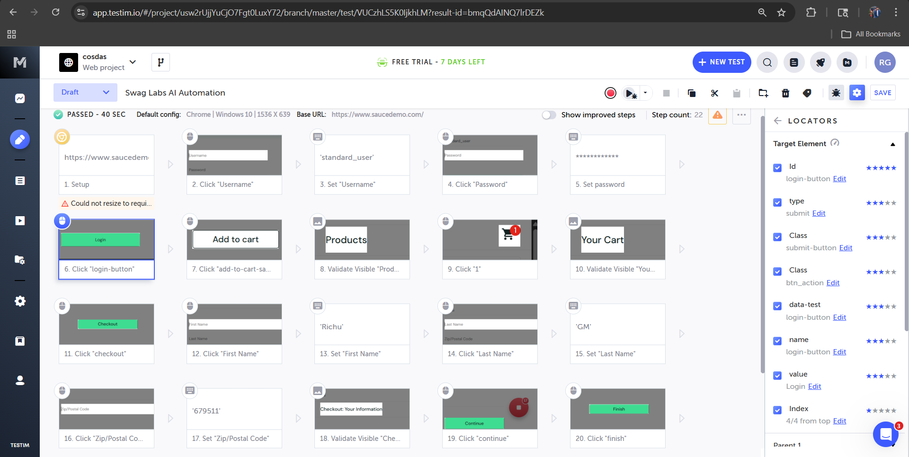
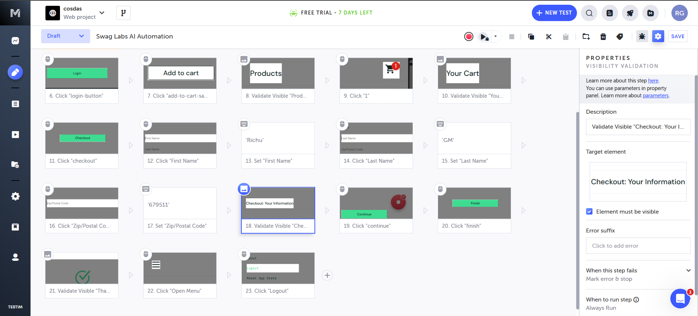

# 🚀 AI-Integrated UI Automation: Swag Labs (SauceDemo)

## 📌 Project Overview
This project demonstrates advanced functional UI automation using **Testim.io**, focusing on AI-driven stability and self-healing locators. As an **AI Integrated Software Tester**, I built this suite to showcase how modern tools reduce maintenance overhead compared to traditional Selenium scripts.

## 🧠 Key AI Features Implemented
* **Self-Healing Locators:** Configured "Smart Locators" using a multi-attribute scoring system (ID, CSS, Text, and Class) to ensure test stability even if the UI changes.
* **Intelligent Validations:** Implemented assertions to verify successful login by validating the visibility of specific dashboard elements.
* **Smart Waits:** Leveraged built-in AI wait conditions to handle asynchronous page loads without hardcoded `sleep` commands.

## 🛠️ Tech Stack & Tools
* **Platform:** Testim.io (AI Automation)
* **Application Under Test (AUT):** [SauceDemo (Swag Labs)](https://www.saucedemo.com/)
* **Methodology:** Functional Testing, Regression Testing, AI-Assisted Scripting.

## 📸 Execution Proof
### 1. Automated Test Flow

*Description: A 23-step automated sequence covering login, cart interaction, and UI verification.*

### 2. Smart Locator Analysis (Self-Healing)

*Description: Evidence of the AI scoring system used to identify elements and prevent "Element Not Found" errors.*

### 3. Assertion & Validation

*Description: Final validation step ensuring the "Products" page is correctly rendered post-login.*

---
**Author:** Gopan (Richu)  
**Location:** Palakkad, Kerala (Open to opportunities)
